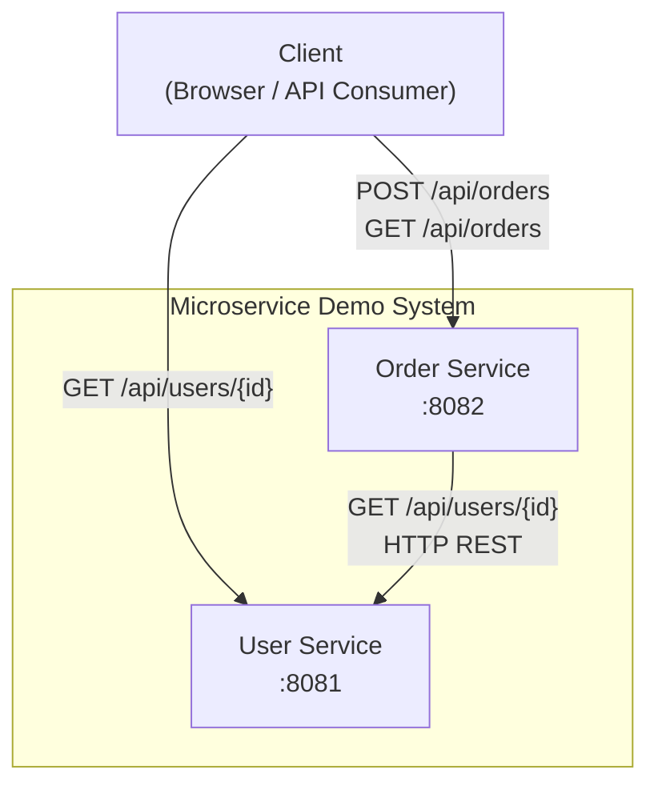
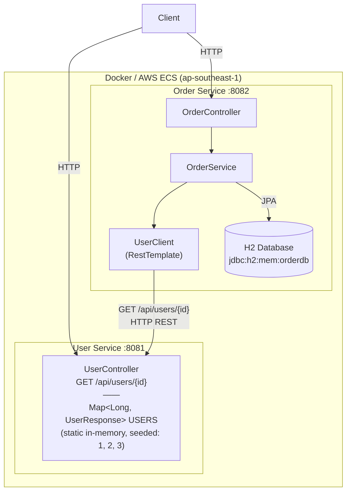
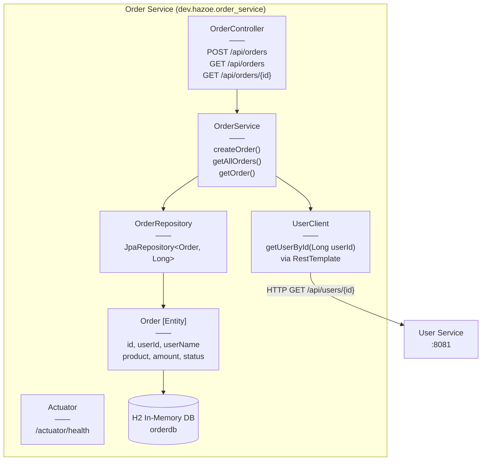
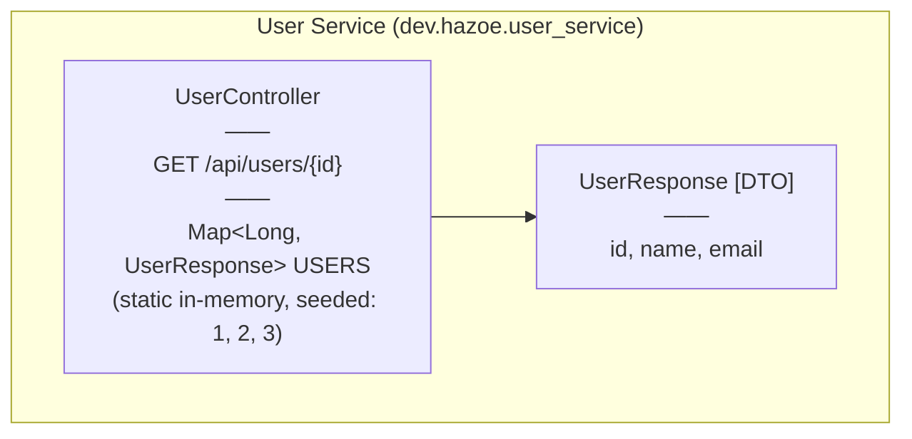
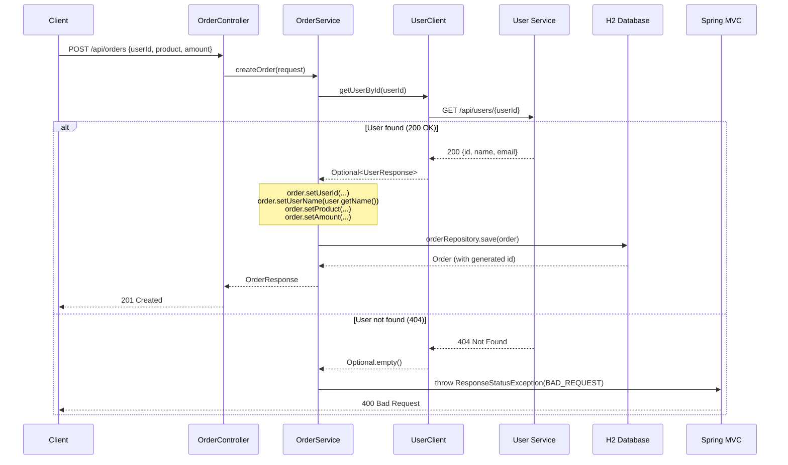
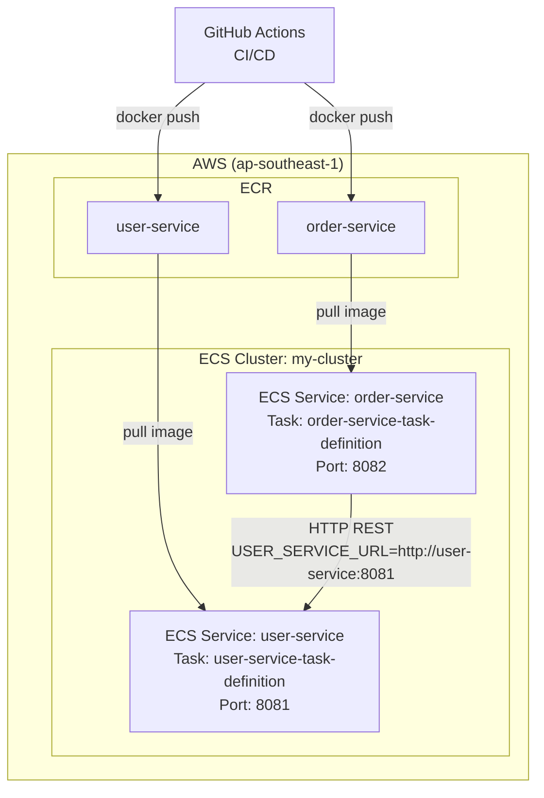

# Component Diagrams — Microservice Demo

## 1. System Context

---

## 2. Container Diagram

---

## 3. Order Service — Internal Components

---

## 4. User Service — Internal Components

---

## 5. Sequence — Create Order Flow

---

## 6. Deployment — AWS

